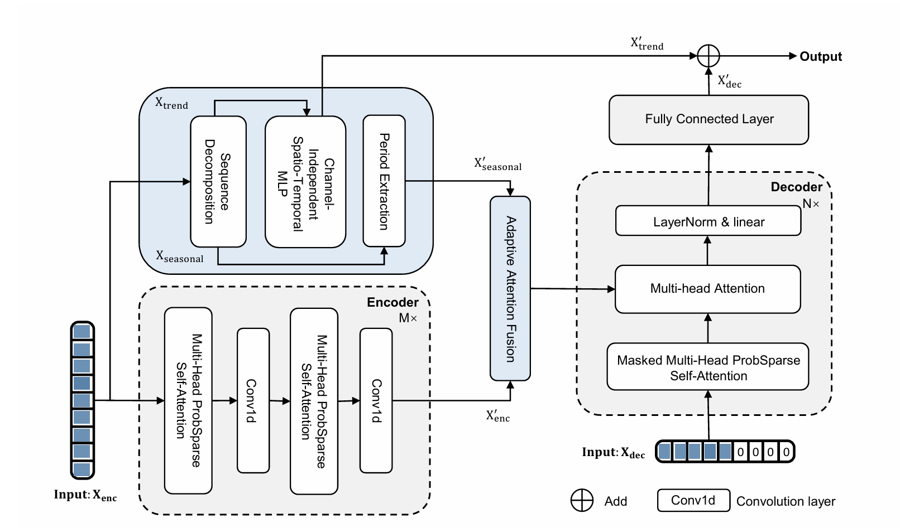

# Informer++: Channel-Independent Trend Modeling and Multi-Scale Seasonal Fusion for Long Horizon Cloud Workload Forecasting.


This is the origin Pytorch implementation of Informer++: Channel-Independent Trend Modeling and Multi-Scale Seasonal Fusion for Long Horizon Cloud Workload Forecasting.


### Key Components

We propose Informer++, a decomposition-enhanced forecasting framework that systematically strengthens the Informer architecture. Informer++ explicitly separates trend and seasonal components, modeling trend dynamics via a Channel-Independent Spatio-Temporal MLP(CIST-MLP) and capturing multi-scale seasonal patterns with a period extraction module, followed by adaptive fusion to generate structured representations for the decoder. 



### Environment Requirements

To get started, ensure you have Conda installed on your system and follow these steps to set up the environment:

```cmd
conda create -n informer_pp python=3.8
conda activate informer_pp
pip install -r requirements.txt
```

### Data preparation

The Google-2011 datasets for our model can be obtained from [Google-cluster-data-2011](https://github.com/google/cluster-data) provided by Google. The Google-2019 datasets for our model can be obtained from [Google-cluster-data-2019](https://github.com/google/cluster-data) provided by Google. The Alibaba-2018 datasets for our model can be obtained from [Alibaba-cluster-data-2018](https://github.com/alibaba/clusterdata) provided by Alibaba Group. The Azure-2017 datasets for our model can be obtained from [Azure-cluster-data-2017](https://github.com/Azure/AzurePublicDataset) provided by Microsoft. Create a separate folder named `./dataset` and place all the CSV files in this directory.

### Training Example

You can easily reproduce the results from the paper by running the provided script command. For instance, to reproduce the main results, execute the following command:

```cmd
sh scripts/workload.sh
```

### Acknowledgement

We appreciate the following github repo very much for the valuable code base :

https://github.com/zhouhaoyi/Informer2020

https://github.com/thuml/Autoformer

https://github.com/vivva/DLinear

https://github.com/PatchTST/PatchTST

https://github.com/Thinklab-SJTU/Crossformer

https://github.com/WindySha/Xpatch

https://github.com/aikunyi/Amplifier

https://github.com/thuml/iTransformer

https://github.com/thuml/TimesNet

https://github.com/chenzRG/Fredformer

